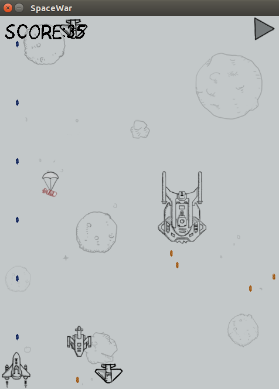
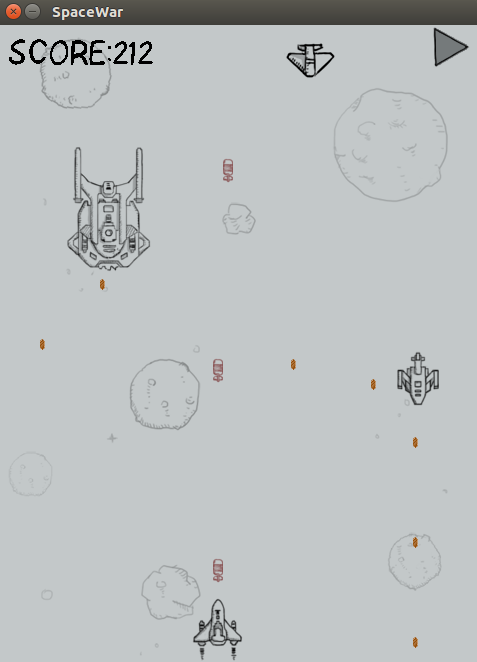
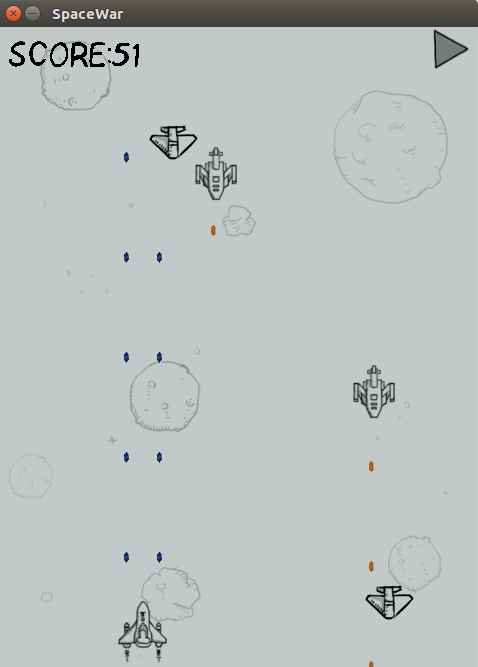
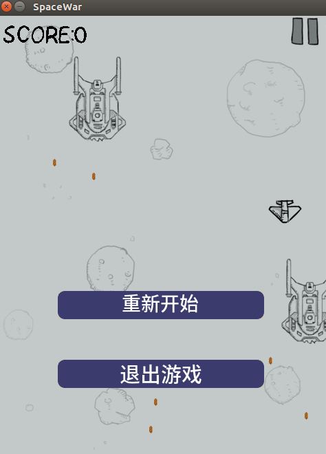

# SpaceWar

## SpaceWar 游戏界面
<div> </div>

道具界面
<div> </div>
<div> </div>

选项界面
<div> </div>

## SpaceWar 文件说明
|-src   源代码文件夹
```
| |-main.cpp    主函数
| |-enum.h    存放全局枚举变量
| |-global.h global.cpp   存放全局变量
| |-texture.h texture.cpp   纹理渲染
| |-scheduler.h scheduler.cpp   调度器,控制游戏的进度
| |-hero.h hero.cpp   玩家控制的飞船
| |-enemy.h enemy.cpp   敌机
| |-launcher.h launcher.cpp   子弹发射器
| |-bullet.h bullet.cpp   子弹
| |-ufo.h ufo.cpp   道具
| |-collision.h collision.cpp   碰撞检测
|-image   图片素材文件夹
|-music   音乐素材文件夹
|-ttf   字体素材文件夹
```

## SpaceWar 游戏玩法
* 上下左右控制飞船的移动,消灭敌机.其中导弹的威力是普通炮的十倍.
* 敌机的威力各不相同,尤其是最厉害的敌机,如果不被打死,它是不会消失的.
* 你的生命只有一条,如果被子弹打中或者被敌机碰到则游戏结束.


## SpaceWar 说明
这个游戏是参照微信的经典飞机大战,不过音效由于SDL的不支持,所以我自己另找了一些音效.里面的敌机有三种,随机出现,并且最难的出现的概率最低.
这个游戏是基于SDL2使用C++完成.

## 编译游戏
```
g++ *.cpp -std=c++11 -lSDL2 -lSDL2_image -lSDL2_ttf -lSDL2_mixer
```

## 作者
* 个人网站：http://monster-l-bar.com
* 邮箱：monster.l.bar@gmail.com
