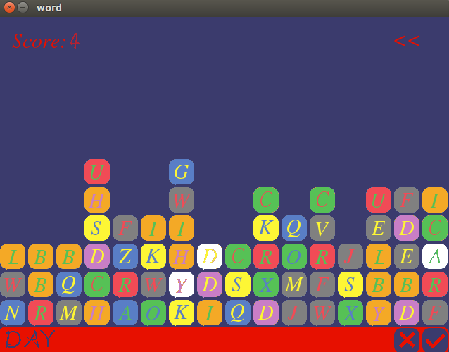

# wordApp - SDL2

##wordApp 游戏界面
<div></div>


## wordApp 游戏文件说明
```
 |——main.cpp    主循环
 |——global.cpp global.h   存放全局变量
 |——texture.cpp texture.h   纹理渲染类
 |——interface.cpp interface.h   主界面
 |——setting.cpp setting.h   设置音效界面
 |——edit.cpp edit.h   编辑文件
 |——file.cpp file.h   文件操作
 |——game.cpp game.h   游戏操作
 |——element.cpp element.h   游戏中的元素
 |——file    文件
 |  |——word.txt   用来存放单词库和对应的分数
 |——image
 |  |——A.png - Z.png    A-Z方块图片
 |  |——AC.png - ZC.png    A-Z被选中的方块图片
 |  |——interface.png    主界面图片
 |  |——setting.png    设置界面背景
 |  |——setbutton.png    设置界面的按钮
 |  |——edit.png   编辑界面背景
 |  |——editdelete.png   编辑界面的删除和编辑按钮
 |  |——game.png   游戏背景图
 |  |——gameover.png   游戏结束背景图
 |——music
 |  |——background.wav   背景音乐
 |  |——down.wav   生成方块时的音效
 |  |——error.wav    单词输入错误时的音效
 |  |——wipe.wav   成功消除方块的音效
 |——ttf
 |  |——word.ttf   游戏使用的字体文件
```


## 游戏玩法
* 在文件中编辑你想要拼写的单词以及它对应的分数
* 在游戏中拼写正确的单词，即可以消除相应的字母并获得对应的分数
* 游戏将随机生成新的字母，如果某一列的字母超过了它的最长高度，则游戏结束


## 编译游戏
```
g++ *.cpp -std=c++11 -lSDL2 -lSDL2_image -lSDL2_ttf -lSDL2_mixer
```
ps:你也可以自己编写makefile文件来进行编译，我这里省略了makefile文件


## 作者
* 个人网站：http://monster-l-bar.com
* 邮箱：monster.l.bar@gmail.com
